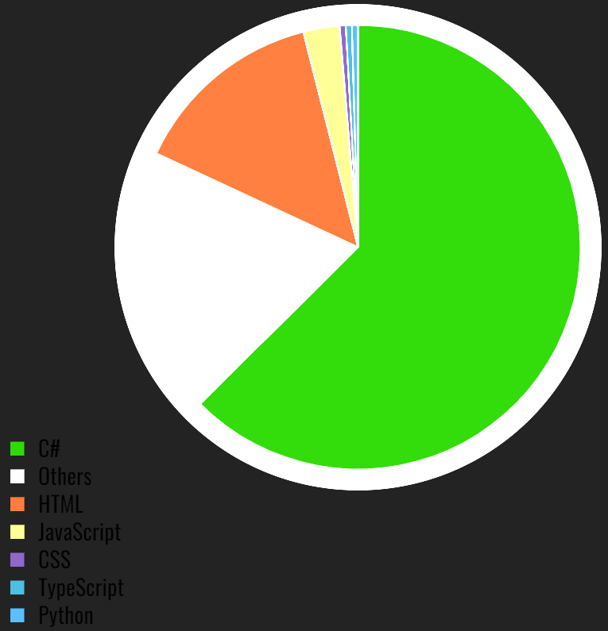

# Feature Repos

 

# 👩‍💻 Languages

| <!---->   | <!--  -->  | <!--  -->  | <!--  --> | 
<!-- |---|---|---|---| -->
|   |    |   |   |
 
 # 👩‍💻 IDE

|   |   |   |   |  
|---|---|---|---|---|

# 📇 Contact Me

|  📱 Contact  |  🤜🤛 Group  |  👨👩 Social  |
|---|---|---|
|   |   |   |
|    |    |    |
|    |   |   |

 

###  [🔝](#)
